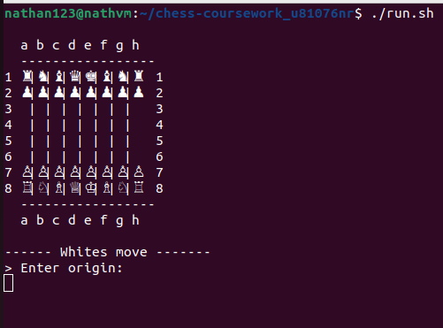
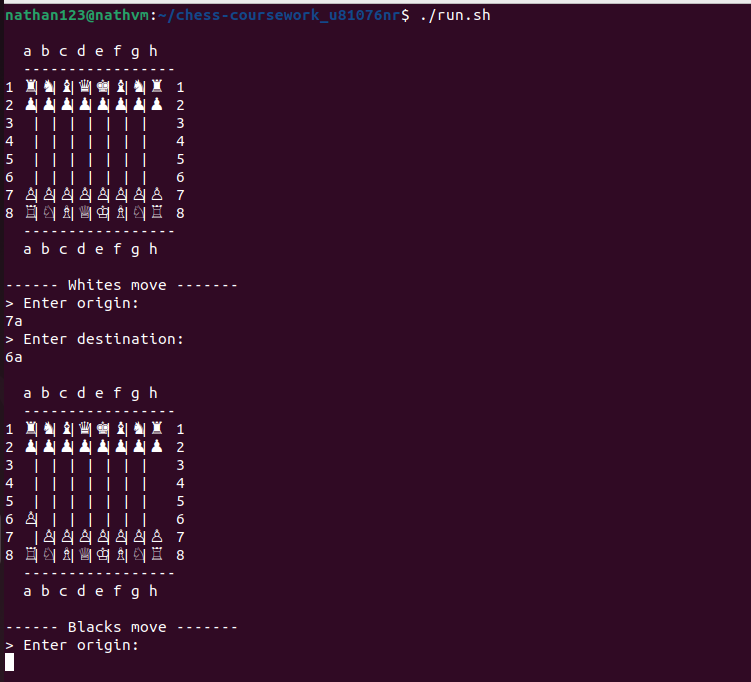

# 1. Chess Game  HomePage

# 2. Gameplay

# 3. Instructions to Run the Game

To start the game, follow these steps:

Open the terminal.
Navigate to the chess-coursework-u81076nr directory.
Run the game by typing the following command:
./run.sh

# 4. How to Play

White moves first in chess.
When prompted for a move, type the origin square (e.g., 6a) and press Enter.
Then, type the destination square (e.g., 7a) and press Enter.
Example: Moving a pawn from 6a to 7a.

# 4. Credits

**Nathan Robel**  
2024  
A 2 Player Chess Game using Java

